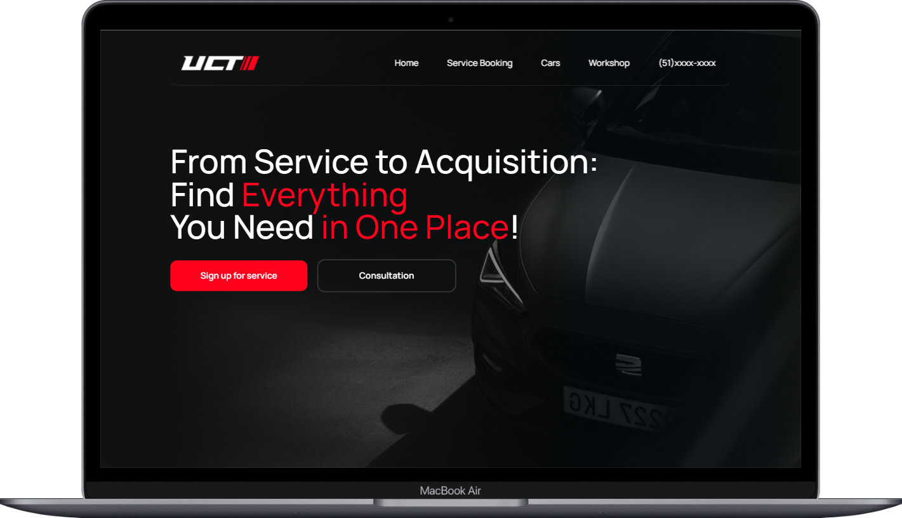

<h1 align="center">
  Car Sale 🚗
</h1>

  <a href="#-layout">Layout</a>&nbsp;&nbsp;&nbsp;|&nbsp;&nbsp;&nbsp;
  <a href="#-tecnologias">Tecnologias</a>&nbsp;&nbsp;&nbsp;|&nbsp;&nbsp;&nbsp;
  <a href="#-projeto">Projeto</a>&nbsp;&nbsp;&nbsp;|&nbsp;&nbsp;&nbsp;
  <a href="#-licença">Licença</a>&nbsp;&nbsp;&nbsp;|&nbsp;&nbsp;&nbsp;
  <a href="#-contato">Contato</a>

 

## 🎨 Layout

Aqui você pode conferir o layout do projeto.  

[👉 Link para visualizar a pagina completa](https://car-sale-gabrielfleckl.vercel.app/)

 
   

---

## 🚀 Tecnologias

Esse projeto foi desenvolvido com as seguintes tecnologias:

 
 

## 💻 Projeto

O site para uma vendedora de carros multifacetada, que oferece uma variedade de serviços automotivos. Desenvolvido com tecnologias modernas como <strong>React Three Fiber</strong>ong> e <strong>Tailwind</strong> CSS, o site é visualmente atraente e responsivo. Um dos destaques é a presença de um modelo 3D de uma <strong>Lamborghini</strong>, permitindo aos usuários explorar o carro em detalhes. Além disso, há um recurso interessante que permite ativar o <strong>modo de primeira pessoa</strong> para uma experiência imersiva. Este site oferece uma experiência única ao unir a venda de carros com serviços automotivos, enquanto utiliza tecnologias avançadas para envolver os usuários.

## 📝 Licença

Esse projeto está sob a licença MIT. Veja o arquivo [LICENSE](LICENSE) para mais detalhes.

## 🌐 Contato

 

---

Feito com ♥ by Gabriel Gonçalves 🖖 &nbsp;&nbsp;&nbsp;|&nbsp;&nbsp; <a href="#--exstore-">Voltar para o Inicio ⬆️ </a>